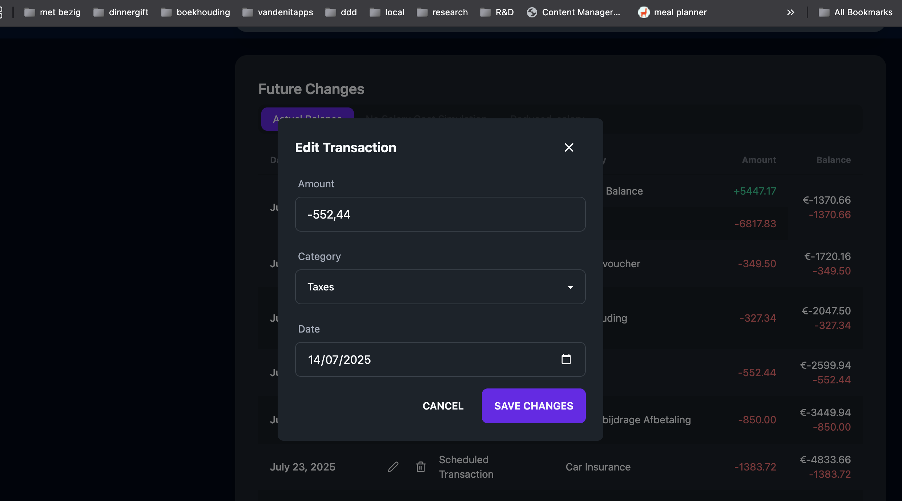

# Simulation improvement for 4th of juli 2025

# add scheduled transactions

- make sure you can add scheduled transactions in the same way as for the edit. see screenshot:
- reuse code
- add unit tests for api
- be able to add it from prediction homepage
